# Backend d’une application type doodle rest/servlet – Maud Garçon & Saly Knab
Cette année nous avons eu l’occasion de créer une application de type doodle. C’est-à-dire, un système permettant la création de sondages à envoyer à des participants afin de choisir une date de réunion appropriée.

Pour ce faire nous avons, avant tout, réalisé la base de données correspondante. Elle est représentée ci-dessous.


Ici, nous avons choisi des tables simples qui sont :
* Sondage : qui va enregistrer les particularités d’un sondage
* Participant : qui peut être participant et/ou créateur de sondage
* Reponse : qui enregistre la réponse du participant
* Date : qui enregistre les dates entrées lors de la création d’un sondage
* Réunion : qui est le sujet d’un sondage

## Installation 

Nous avons réalisé notre projet sous le logiciel intelliJ.

Dans un premier temps, il faut installer maven et tomcat7.
Lancez : `mvn dependency :copy-dependencies`.

Afin que l’on puisse faire la connexion backend <-> base de données, nous devons préalablement créer un répertoire de données.
Pour ce faire il faut, à la racine du projet, créer un dossier ‘data’. (Cette manipulation est à réaliser qu’une seule fois)
Suite à cela, dans le terminal, nous devons entrer dans le répertoire ‘data’ que nous venons de créer (‘SIR\data>’) et entrez :

```java -cp ../target/dependency/hsqldb-2.3.4.jar org.hsqldb.Server```

Dans un autre terminal, il faut entrer à la racine :

```java -cp target/dependency/hsqldb-2.3.4.jar org.hsqldb.util.DatabaseManager```

Cette dernière ligne ouvrira la base de données. Vous tomberez sur cette page :


Entrez les informations telles qu’elles sont indiquées ci-dessus.
Une fois que vous avez cliqué sur ‘Ok’, vous avez accès à cette page :


Ceci est la base de données qui est actuellement vide.
Pour que la base de données se remplisse il faut lancer la classe ‘testjpa’ sous tomcat7. L’affichage se fera au bout d’un certain temps, il faudra rafraîchir la page pour que ça s’affiche.


(Ci-dessus le raccourcis permettant le lancement rapide de cette classe)

## Lancement du serveur

Nous avons donc accès au serveur via le lien : http://localhost:8080/

Si vous entrez cela dans une page web, vous aurez accès à la partie servlet de ce projet.
Pour les tests de la partie rest, nous avons utilisé Postman.

### Les DAO
Afin de gérer la connexion entre l’application et la base de données, nous avons créés des DAO.
Dans ces DAO nous retrouvons les requêtes :

*	getAll
*	create
*	getId
*	update
* delete

Que ce soit pour la partie servlet ou bien rest, nous utilisons les DAOs.

#### Les servlets
Sur le lien localhost:8080, nous arrivons sur cette page :

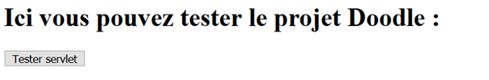

Si l’on clique, on arrive sur cette page :

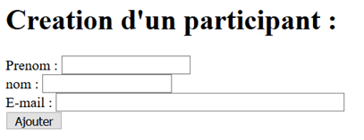

Une fois que l’on crée une personne, nous avons son récapitulatif :

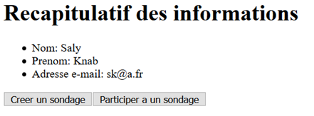

Sur cette page, nous avons le choix entre la création d’un sondage ou bien la participation à un sondage.

Si l’on choisi la participation à un sondage, nous arrivons sur la liste des sondages.

Si l’on décide de créer un sondage, nous arrivons sur cette page :

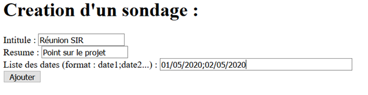

Une fois le formulaire rempli, nous avons le récapitulatif de ce sondage.

Participation à un sondage :

Pour participer à un sondage, il suffit de choisir le sondage et sélectionner la date souhaitée puis valider.

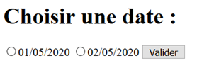

#### Rest
Les tests de rest se font sur Postman (dans les démonstrations ci-dessous).

Dans un premier temps, voici le test pour l’affichage des participants :

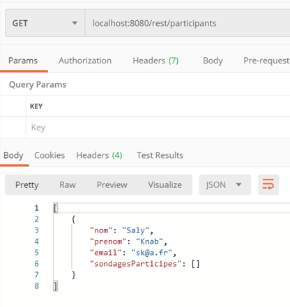

Nous avons donc bien un participant.

*Création d’un participant :*

Nous changeons le ‘get’ en ‘post’ à gauche du lien, ce qui va permettre de différencier la création de l’affichage d’un participant.
Ne pas oublier de remplir le header comme ceci :

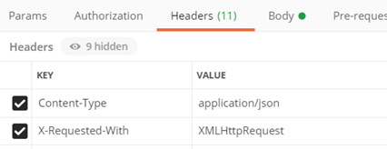

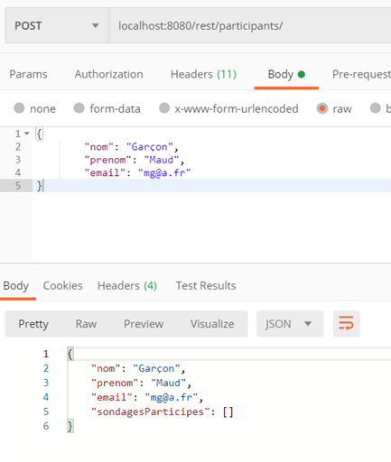

*Changement des caractéristiques d’un participant :*

Ici, nous souhaitons modifier le prénom du participant. Pour cela il faut :
* Ajouter l’identifiant après le lien ( /id)
* Modifier le ‘post’ en ‘put’

Je change donc, ‘Maud’ en ‘Marie’ comme ceci : 

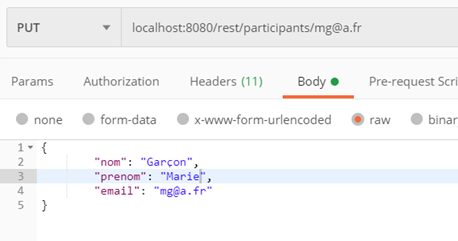

Si nous relançons la page getAll nous avons bien la modification :

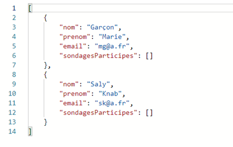

*Suppression :*

Pour la suppression, nous gardons la mise en page du ‘getAll’ (donc sans header ni body), nous ajoutons le ‘/id’ à la fin du lien et nous changeons le ‘GET’ en ‘DELETE’.

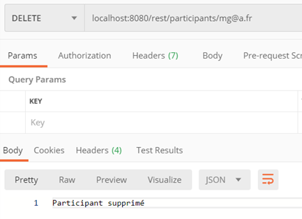

L’id étant l’adresse mail, nous avons bien le message de confirmation.
Il ne reste plus qu’un participant.

## Front-end

En IDE : Webstorm avec comme langage angular

Pour lancer l’application :
* dans un terminal aller dans data : cd data, puis lancer le server (même commande que pour le backend - Partie 1 : Installation)
* dans un autre terminal lancer le manager (idem que dans 'Installation')
* dans un autre terminal lancer `tomcat7:run`
* dans un autre terminal faire `npm install -g @angular/cli` puis `ng serve`

On peut accèder au test sur localhost:4200 (ou on peut aussi passer par un bouton sur le localhost:8080)

On a utilisé des services pour faire le lien entre l’API rest & le front : service pour les user, pour les sondages ...
On a utilisé des composants pour l’affichage ou les formulaires : créer un user, créer un sondage …
On a utilisé angular materials pour que ce soit plus propre

