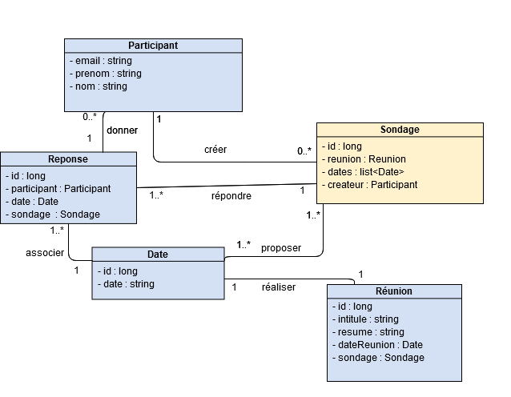

# Backend d’une application type doodle rest/servlet – Maud Garçon & Saly Knab
Cette année nous avons eu l’occasion de créer une application de type doodle. C’est-à-dire, un système permettant la création de sondages à envoyer à des participants afin de choisir une date de réunion appropriée.

Pour ce faire nous avons, avant tout, réalisé la base de données correspondante. Elle est représentée ci-dessous.

Ici, nous avons choisi des tables simples qui sont :
* Sondage : qui va enregistrer les particularités d’un sondage
* Participant : qui peut être participant et/ou créateur de sondage
* Reponse : qui enregistre la réponse du participant
* Date : qui enregistre les dates entrées lors de la création d’un sondage
* Réunion : qui est le sujet d’un sondage

## Installation 

Nous avons réalisé notre projet sous le logiciel intelliJ.

Dans un premier temps, il faut installer maven et tomcat7.
Lancez : mvn dependency :copy-dependencies.

Afin que l’on puisse faire la connexion backend <-> base de données, nous devons préalablement créer un répertoire de données.
Pour ce faire il faut, à la racine du projet, créer un dossier ‘data’. (Cette manipulation est à réaliser qu’une seule fois)
Suite à cela, dans le terminal, nous devons entrer dans le répertoire ‘data’ que nous venons de créer.
‘SIR\data>’ et entrer :

java -cp ../target/dependency/hsqldb-2.3.4.jar org.hsqldb.Server

Dans un autre terminal, il faut entrer à la racine :
java -cp target/dependency/hsqldb-2.3.4.jar org.hsqldb.util.DatabaseManager

Cette dernière ligne ouvrira la base de données. Vous tomberez sur cette page :

Et, entrez les informations telles qu’elles sont indiquées ci-dessus.
Une fois que vous avez cliqué sur ‘Ok’, vous avez accès à cette page :

